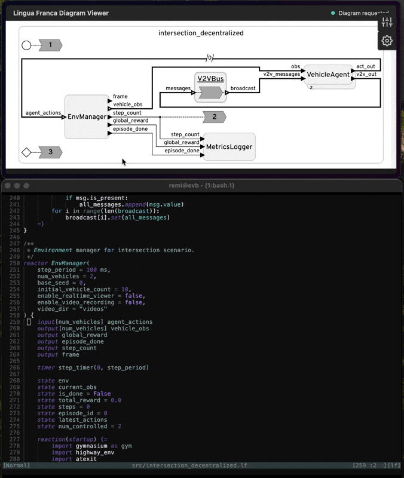

# lf.nvim

Comprehensive Neovim plugin for [Lingua Franca](https://www.lf-lang.org/) with syntax highlighting, LSP support, and interactive diagram viewing.



## ✨ Features

### 🎨 Syntax Highlighting (Always Available)
- **Tree-sitter support** - Modern, accurate syntax highlighting with `:LFInstall`
- **Incremental selection** - Expand/shrink selection by AST nodes (works with nvim-treesitter)
- **Textobjects** - Select functions, classes, parameters with treesitter-textobjects
- **Embedded language support** - Proper highlighting for C/C++, Python, TypeScript, and Rust code blocks
- **Automatic target detection** - Detects target language from `target` declarations
- **Fallback regex syntax** - Works without treesitter for basic highlighting
- **Cross-platform** - Works on Mac, Linux, and Windows

### 🚀 LSP Features (Mac/Linux Only)
> **Note**: LSP features require Mac or Linux as Lingua Franca doesn't support Windows

- **Full LSP Support** - Diagnostics, completion, hover, go-to-definition, references
- **Build Integration** - Build and run LF programs from Neovim with progress reporting
- **Interactive Diagrams** - View and interact with KLighD reactor diagrams in browser
- **Jump to Source** - Click diagram elements to jump to code locations
- **Library Browser** - Browse and import reactor libraries with Telescope
- **AST Viewer** - Inspect abstract syntax tree
- **Real-time Validation** - Auto-validate on save with quickfix integration

## 📦 Installation

### Minimal (Syntax Only)

For users who only want syntax highlighting:

```lua
-- lazy.nvim
{
  "remifan/lf.nvim",
  ft = "lf",
  config = function()
    require("lf").setup({
      enable_lsp = false,  -- Disable LSP features
      syntax = {
        auto_detect_target = true,
        indent = { size = 4, use_tabs = false },
      },
    })
  end,
}
```

### Full Setup (Syntax + LSP + Diagrams)

For the complete experience with LSP, diagrams, and all features (Mac/Linux):

```lua
-- lazy.nvim
{
  "remifan/lf.nvim",
  ft = "lf",
  dependencies = {
    "nvim-telescope/telescope.nvim",  -- Optional: enhanced library browser
  },
  -- Note: Diagram dependencies build automatically on first use
  -- No need to specify build command!
  config = function()
    require("lf").setup({
      enable_lsp = true,

      -- Syntax highlighting
      syntax = {
        auto_detect_target = true,
        target_language = nil,  -- or "C", "Cpp", "Python", "Rust", "TypeScript"
        indent = { size = 4, use_tabs = false },
      },

      -- LSP configuration
      lsp = {
        -- Auto-detected if nil. Priority order:
        -- 1. Environment variable: LF_LSP_JAR
        -- 2. Explicit jar_path config below
        -- 3. Common locations (~/lingua-franca/lsp/build/libs/, etc.)
        jar_path = nil,  -- or vim.fn.expand("~/lingua-franca/lsp/build/libs/lsp-*-all.jar")
        java_cmd = "java",
        java_args = { "-Xmx2G" },
        auto_start = true,
      },

      -- Build settings
      build = {
        auto_validate = true,
        show_progress = true,
        open_quickfix = true,
      },

      -- Keymaps
      keymaps = {
        build = "<leader>lb",
        run = "<leader>lr",
        diagram = "<leader>ld",
        library = "<leader>ll",
        show_ast = "<leader>la",
      },

      -- Diagram settings
      diagram = {
        no_browser = true,   -- Default: show URL without auto-opening browser (good for SSH)
                             -- Set to false to auto-open browser locally
        auto_update = true,  -- Auto-refresh diagram when switching between LF files
      },
    })
  end,
}
```

## 🌳 Tree-sitter Setup

For modern syntax highlighting, incremental selection, and textobjects:

```vim
:LFTSInstall
```

This installs the LF tree-sitter parser and query files. Requires:
- `nvim-treesitter` plugin
- C compiler (gcc or clang) if compiling from source

**Tree-sitter Commands:**

| Command | Description |
|---------|-------------|
| `:LFTSInstall` | Install LF tree-sitter parser and queries |
| `:LFTSInstall!` | Force reinstall (with bang) |
| `:LFTSUninstall` | Remove LF tree-sitter parser |
| `:LFTSStatus` | Show tree-sitter installation status |

**Incremental Selection** (with nvim-treesitter configured):
- Press `<CR>` in normal mode to start selection
- Press `<CR>` again to expand to next AST node
- Press `<BS>` to shrink selection

## 🛠️ LSP Setup (Optional)

LSP features require the Lingua Franca LSP server JAR.

### Build from Source

```bash
# Clone Lingua Franca repository
git clone https://github.com/lf-lang/lingua-franca.git
cd lingua-franca

# Build LSP server
./gradlew buildLsp

# JAR location: lsp/build/libs/lsp-VERSION-SNAPSHOT-all.jar
```

### Configuration Methods

The plugin finds the LSP JAR in this priority order:

**1. Environment Variable (Recommended)**

Set `LF_LSP_JAR` in your shell profile:

```bash
# In ~/.bashrc, ~/.zshrc, or shell config
export LF_LSP_JAR="$HOME/lingua-franca/lsp/build/libs/lsp-0.8.1-SNAPSHOT-all.jar"

# Or with wildcard (auto-expands to latest)
export LF_LSP_JAR="$HOME/lingua-franca/lsp/build/libs/lsp-*-all.jar"
```

**2. Explicit Configuration**

```lua
lsp = {
  jar_path = vim.fn.expand("~/lingua-franca/lsp/build/libs/lsp-*-all.jar"),
}
```

**3. Auto-Detection**

If neither above is set, searches common locations:
- `~/lingua-franca/lsp/build/libs/lsp-*-all.jar`
- `./lsp/build/libs/lsp-*-all.jar` (current directory)
- `../lingua-franca/lsp/build/libs/lsp-*-all.jar` (parent directory)

### Verify Installation

```vim
:checkhealth lf
```

## 🚀 Usage

### Syntax Highlighting Commands

Available in all modes (no LSP required):

| Command | Description |
|---------|-------------|
| `:LFInfo` | Show plugin configuration and detected target language |
| `:LFDetectTarget` | Manually detect target language from current buffer |
| `:LFUpdateSyntax` | Update syntax from VSCode extension (requires internet) |
| `:LFUpdateSyntaxDryRun` | Preview available syntax updates |
| `:LFShowKeywords` | Display all LF keywords from VSCode grammar |

### LSP Commands

Only available when LSP is enabled (Mac/Linux):

| Command | Description |
|---------|-------------|
| `:LFBuild` | Build current LF program |
| `:LFRun` | Build and run current LF program |
| `:LFDiagramOpen` | Open interactive KLighD diagram in browser (auto-builds on first use) |
| `:LFDiagramBuild` | Manually build diagram dependencies (if auto-build fails) |
| `:LFDiagramClose` | Close diagram viewer |
| `:LFLibrary` | Browse reactor library (uses Telescope if available) |
| `:LFShowAST` | Show abstract syntax tree |
| `:LFLspInfo` | Show LSP server status |
| `:LFLspRestart` | Restart LSP server |

### Default Keybindings (LSP Mode)

When in a `.lf` buffer with LSP enabled:

- `<leader>lb` - Build current file
- `<leader>lr` - Build and run
- `<leader>ld` - View interactive diagram
- `<leader>ll` - Browse reactor library
- `<leader>la` - Show AST

Standard LSP keybindings:
- `gd` - Go to definition
- `gr` - Show references
- `K` - Hover documentation

### Interactive Diagrams

The diagram viewer provides an interactive browser-based view of your reactors:

1. Open a `.lf` file
2. Run `:LFDiagramOpen`
3. **First time only**: Dependencies build automatically (may take a few minutes)
4. Browser opens with interactive diagram at `http://localhost:8765/`
5. **Click elements** to jump to source code in Neovim
6. **Switch files** in Neovim - diagram auto-updates (with `auto_update = true`)
7. Zoom, pan, and explore reactor structure

**Features:**
- [x] Interactive KLighD diagram rendering in browser
- [x] Diagram → Code: Click reactor instances to jump to definition in Neovim
- [x] Auto-refresh diagram when switching between LF files
- [ ] Code → Diagram: Sync cursor position to highlight elements in diagram
- [ ] Diagram element search/filter

**Requirements**: Node.js must be installed for diagram features.

**Troubleshooting**: If auto-build fails, run `:LFDiagramBuild` manually to retry.

**Architecture**: Uses Node.js sidecar to bridge browser ↔ Neovim communication. The browser connects to a singleton server, and diagrams reactively update as you navigate files.

### SSH/Remote Work

By default, diagrams show a URL without auto-opening the browser. Use SSH port forwarding:

```bash
# On your local machine
ssh -L 8765:localhost:8765 user@remote-server
```

When you run `:LFDiagramOpen`, Neovim displays the URL. Open it in your local browser at `http://localhost:8765/`

The diagram will show the current file and auto-update as you switch between files (no file parameter needed in the URL).

**To auto-open browser locally** (disable no-browser mode):

```lua
require("lf").setup({
  diagram = {
    no_browser = false,  -- Auto-open browser
  },
})
```

## 🎨 Syntax Highlighting Details

### Lingua Franca Keywords
- **Core**: `reactor`, `input`, `output`, `action`, `state`, `timer`, `reaction`, `method`, `preamble`
- **Modifiers**: `public`, `private`, `widthof`, `mutable`
- **Control flow**: `if`, `else`, `for`, `while`
- **Temporal**: `startup`, `shutdown`, `after`, `physical`, `logical`

### Literals & Operators
- **Time units**: `nsec`, `msec`, `sec`, `min`, `hour`, `day`, `week`
- **Numbers**: Integers, floats, scientific notation
- **Strings**: Single, double, and triple-quoted with escape sequences
- **Operators**: `->`, `~>`, `::`, arithmetic and logical operators
- **Booleans**: `true`, `false`, `True`, `False`

### Embedded Languages

Code within `{= =}` delimiters gets full syntax highlighting:
- **C/C++**: Functions, keywords, types, preprocessor directives
- **Python**: Keywords, builtins, decorators, string formatting
- **TypeScript**: Types, interfaces, async/await, JSX
- **Rust**: Ownership keywords, macros, lifetimes

### Comments
- Line comments: `//` and `#`
- Block comments: `/* */`
- TODO/FIXME highlighting

## 🔄 Keeping Syntax Updated

Sync with the official VSCode extension:

```vim
:LFUpdateSyntax
```

Or from command line:

```bash
nvim -l scripts/update_syntax.lua
```

See [UPDATING.md](UPDATING.md) for details.

## 📖 Documentation

Comprehensive help documentation:

```vim
:help lf
```

Topics include:
- Installation and configuration
- Syntax highlighting groups
- LSP features and commands
- Diagram interaction
- Target language detection
- Troubleshooting

## 🤝 Contributing

Contributions welcome! This plugin combines:
- Syntax grammar from [VSCode Lingua Franca extension](https://github.com/lf-lang/vscode-lingua-franca)
- LSP server from [Lingua Franca compiler](https://github.com/lf-lang/lingua-franca)

### Reporting Issues

If you encounter:
- Missing keyword highlighting
- Incorrect syntax highlighting
- LSP connection issues
- Diagram rendering problems

Please open an issue with:
1. Example `.lf` file demonstrating the problem
2. Expected vs actual behavior
3. Neovim version (`:version`)
4. Platform (Mac/Linux/Windows)
5. For LSP issues: output of `:checkhealth lf` and `:LspLog`

### Development

```bash
# Clone the repository
git clone https://github.com/remifan/lf.nvim.git
cd lf.nvim

# Test locally (syntax only)
nvim -u NONE -c "set rtp+=." test.lf

# Install diagram dependencies (for LSP features)
cd diagram-server && npm install
```

## 🔧 Troubleshooting

### Syntax Highlighting Not Working

1. Verify filetype is detected: `:set ft?` should show `filetype=lf`
2. Force syntax reload: `:syntax sync fromstart`
3. Check for conflicting plugins

### LSP Server Not Starting

1. Verify Java is installed: `java -version` (requires Java 17+)
2. Check JAR path: `:checkhealth lf`
3. Manually test server: `java -jar /path/to/lsp-*-all.jar`
4. Check Neovim LSP logs: `:LspLog`

### Diagrams Not Opening

1. Ensure Node.js is installed: `node --version`
2. Install dependencies: `cd diagram-server && npm install`
3. Check sidecar logs in `:messages`

### Performance Issues

1. Increase JVM heap: `java_args = {"-Xmx4G"}`
2. Disable auto-validation: `build.auto_validate = false`

## 📖 Resources

- **Lingua Franca**: https://www.lf-lang.org/
- **LF Documentation**: https://www.lf-lang.org/docs/
- **LF Compiler**: https://github.com/lf-lang/lingua-franca
- **VSCode Extension**: https://github.com/lf-lang/vscode-lingua-franca

## 📄 License

MIT License - see [LICENSE](LICENSE) file for details.

## 🙏 Acknowledgments

- Syntax grammar based on the official [VSCode Lingua Franca extension](https://github.com/lf-lang/vscode-lingua-franca)
- LSP server from the [Lingua Franca compiler project](https://github.com/lf-lang/lingua-franca)
- Built for the [Lingua Franca](https://www.lf-lang.org/) community
